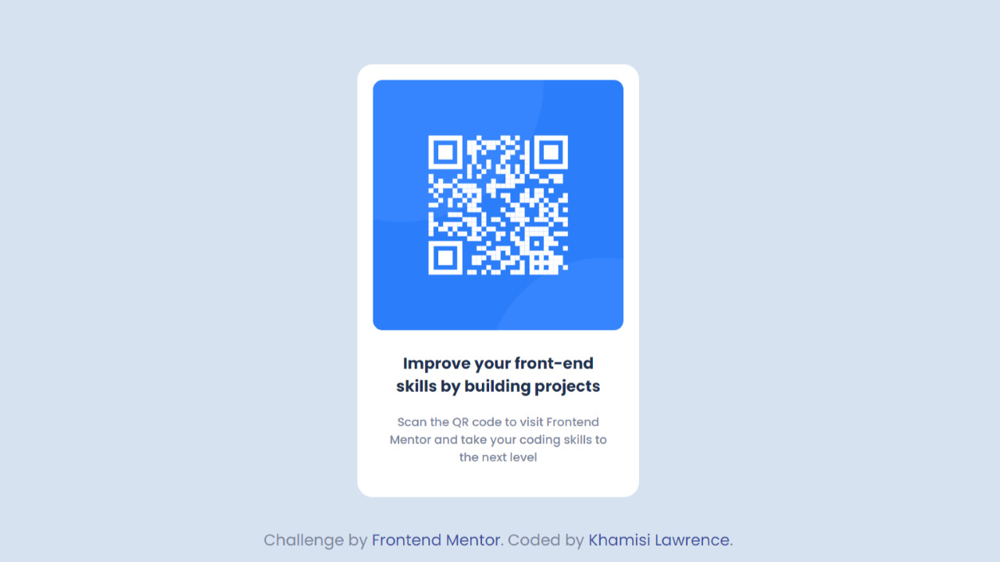

# Frontend Mentor - QR Code Component Solution

This is a solution to the [QR code component challenge on Frontend Mentor](https://www.frontendmentor.io/challenges/qr-code-component-iux_sIO_H).

## Table of contents

- [Overview](#overview)
  - [Screenshot](#screenshot)
  - [Links](#links)
- [My process](#my-process)
  - [Built with](#built-with)
- [Author](#author)

## Overview

This QR code component challenge provides an opportunity to enhance front-end development skills by following the specified style guide to build a visually appealing QR code component.

The component is designed to fit seamlessly into a webpage, allowing users to scan the QR code and easily navigate to Frontend Mentor for skill advancement.

### Screenshot

### Links

- Solution URL: [Add solution URL here](https://your-solution-url.com)
- Live Site URL: [Add live site URL here](https://your-live-site-url.com)

## My process

1. **Understanding the Design**: I started by thoroughly studying the provided style guide, focusing on layout specifications, color choices, and typography preferences. This understanding laid the foundation for a cohesive and harmonious integration of the QR code component into the overall design.

2. **HTML Structure**: I structured the HTML to create a container for the content, including a heading, a descriptive paragraph, the QR code itself, and attribution details. This layout ensures a logical flow and readability of the content.

3. **CSS Styling**: I implemented styling rules to adhere to the style guide, prioritizing responsiveness and setting appropriate font sizes.

4. **Optimizing for Various Devices**: Employing media queries and relative measurement units, I ensured that the QR code component looks polished on both mobile and desktop devices. The responsive design guarantees a seamless user experience across a range of screen sizes.

5. **Testing and Refinement**: Before finalizing the code, I conducted thorough testing on different browsers and devices to ensure cross-browser compatibility.

### Built with

- Semantic HTML5 markup
- CSS Nesting
- Flexbox

## Author

- GitHub - [Khamisi Lawrence](https://github.com/khamisilawrence)
- Frontend Mentor - [@khamisilawrence](https://www.frontendmentor.io/profile/khamisilawrence)
